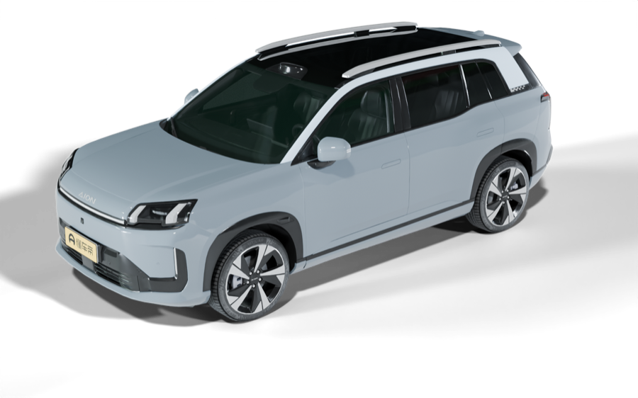

# GAC Connect for Home Assistant (unofficial)

> **⚠️ BETA — not fully tested, use entirely at your own risk.** This is an
> unofficial integration with no relationship to GAC. Expect bugs; things that
> worked yesterday may not work tomorrow. Remote commands physically act on your
> vehicle (A/C, locks, windows, tailgate, charging) and may misbehave or fail;
> using it alongside the official app may sign one of them out. Nothing here is
> warranted to work, keep working, or be safe. Review what an automation can do
> before you let it touch the car.

Monitor and control a **GAC / Aion** vehicle in Home Assistant — battery, range,
odometer, charging, doors and windows, tyres, and charge control.

> This project is not affiliated with, endorsed by, or supported by GAC or its
> affiliates. GAC and AION are third-party trademarks of their respective
> owners. Use it with a vehicle you own, on your own account.

Supports **Australia and New Zealand**. Other regions appear in the list but
are best-effort.

## Install (HACS)

Releases are published as **pre-releases** while the project is in beta. In
HACS, open the integration's page and enable *Show beta versions* to see them.

Click the badge above for one-click add, or add it manually:

1. HACS → three-dot menu → **Custom repositories**.
2. Add this repository, category **Integration**.
3. Install **GAC Connect (unofficial)**, then restart Home Assistant.
4. **Settings → Devices & Services → Add Integration → GAC Connect.**

## Set-up

You sign in with the mobile number on your GAC account:

1. Choose your region and enter your mobile number.
2. A window opens with a **slide puzzle** — drag the piece into the gap and press
   Verify (arrow keys nudge it a pixel).
3. Enter the **SMS code** sent to your phone.
4. Pick your vehicle. Done.

If the puzzle is off by a little it just shows a new one — keep going until it
takes.

## Entities

- **Sensors**: battery, range, odometer, cabin temperature and PM2.5, 12 V battery,
  charge power, voltage, current and estimated time, per-tyre pressure and temperature, and the
  time of the car's last report (the reported charge window is available as
  disabled-by-default diagnostics).
- **Binary sensors**: plugged-in, charging, door / window / boot open, lock,
  charger lock, online.
- **Climate**: cabin pre-conditioning (A/C, auto mode) with a target temperature;
  a run lasts the "A/C run time" option (default 30 minutes).
- **Lock**: lock the doors from Home Assistant (unlocking needs the car's
  remote-control PIN, which is not supported yet, and reports an error).
- **Covers**: windows, sunroof and tailgate (state may read unknown when the car
  does not report it; open / close still work). Opening really opens them — treat
  automations that touch these with care.
- **Switches**: pre-conditioning (plain A/C on / off), scheduled charging (the
  charge gate), steering-wheel heat, cabin ventilation, flash lights.
- **Buttons**: charge now / pause, sound horn, precondition battery, refresh.
- **Fridge** (only on cars that have one): an on/off switch, a mode selector
  (off, refrigerate, heat, freeze) and a target temperature whose range follows
  the mode (refrigerate 0 to 20 °C, heat 35 to 50 °C, freeze −15 to −1 °C).
  Switching on resumes the last mode at its last temperature; these are kept
  across restarts. Changing the temperature while the fridge runs sends it
  straight away; while it is off the value is kept for the next start. A request
  shows at once and reverts if the car refuses it or has not confirmed it within
  three minutes. How long it keeps running after you leave the car is a setting
  in the car: *Fridge after leaving* shows it as timed or unlimited, and with a
  timed setting *Fridge time left* counts down in minutes once you leave. An
  automation can watch the switch and attempt a restart. The entities appear once
  the car first reports a fridge. If your car has no fridge but they show up
  anyway, turn off *Fridge / warmer box controls* in the options to remove them.
- **Location tracker** (off by default — enable it in the integration's options).

## Example dashboard

The car renders in `docs/images/` are CC BY 4.0 (see `docs/images/ATTRIBUTION.md`);
copy them to `config/www/car/` to use them in the example.

A ready-made car view using only built-in cards (no extra installs) is in
[`docs/example-dashboard.yaml`](docs/example-dashboard.yaml). Replace the `aion_v`
entity prefix with your vehicle's, then paste the whole file into a new
dashboard via Dashboards → Add Dashboard → Edit → Raw configuration editor.

It covers battery, range, odometer and report freshness; charging state with
power, current and voltage while charging; the remote controls; locks, openings,
cabin temperature and air quality; tyre pressures and temperatures; location;
and, on cars that have one, the fridge (on/off, mode, temperature and the
keep-running setting). The file's header comments explain how to switch tyre pressure to psi,
enable location tracking, and remove the cards that send commands to the car.

## Command results

Remote commands are applied asynchronously. The integration receives each
command's result from the service and refreshes the status straight away, so
entities confirm within seconds rather than at the next poll. A refused command
clears the requested state and is logged. Each result also fires a
`gac_connect_command_result` event (`device_id`, `ok`, `code`, `event`,
`session_id`) for automations.

## Services

`gac_connect.charge_now`, `charge_pause`, `set_charge_window` (a daily
start/stop window, optionally on selected days) and `send_command` (advanced, for
the non-PIN commands by name). Climate and lock are ordinary `climate.*` /
`lock.*` actions on their entities.

Example alerts — low tyre pressure, low 12 V battery, left unlocked at home,
door / window / boot left open — are in
[`docs/example-automations.yaml`](docs/example-automations.yaml).

## Options

Poll interval, quiet hours (skip polling overnight to spare the 12 V battery),
whether the location tracker is enabled, whether the fridge controls are shown,
and how long an A/C run lasts. The poll interval is at least 60 seconds (default
5 minutes).

## Request limits

The integration is built to go easy on GAC's service. Status is polled on the
interval above (never more often than once a minute); refresh presses and the
refreshes that follow commands are merged, and refreshes triggered by command
results are at least 10 seconds apart. Underneath, every request goes through the
`gac-connect` library's limiter, shared by all GAC Connect entries in Home
Assistant: one request at a time, at most one a second, 20 a minute, 240 an hour
and 3000 a day, with commands to the car limited to 6 a minute and 60 an hour. If
the service answers "too many requests", nothing is sent for at least a minute
(longer if the service says so, up to a day).
A request held back by these limits is not sent at all: the entities keep their
last reading, and a command shows an error. The limiter's state is kept in Home
Assistant's storage, so a restart does not reset it or cut short a pause the
service asked for. (If that saved state is ever unreadable, requests pause for a
day, since any pause recorded in it is unknown; deleting
`.storage/gac_connect.request_limits` and restarting resets it.)

## Notes

- Sign-in needs a human (a slide puzzle and an SMS code); there is no headless login.
- Unlock, remote power and charger-release need the car's remote-control PIN,
  which this integration does not support yet; those commands report an error.
- Using the official app and this integration on the same account at the same time
  can occasionally sign one of them out.

## Acknowledgements

This project stands on the shoulders of the community projects that brought other
EV brands into Home Assistant and Python, among them:

- [AwangYes/BYD-re](https://github.com/AwangYes/BYD-re) — BYD
- [Hyundai-Kia-Connect/kia_uvo](https://github.com/Hyundai-Kia-Connect/kia_uvo) — Hyundai / Kia
- [bimmerconnected/bimmer_connected](https://github.com/bimmerconnected/bimmer_connected) — BMW / Mini
- [SAIC-iSmart-API/saic-python-client-ng](https://github.com/SAIC-iSmart-API/saic-python-client-ng) — MG / SAIC
- [kvanbiesen/bmw-cardata-ha](https://github.com/kvanbiesen/bmw-cardata-ha) — BMW CarData

Thanks to their authors for showing what a good community integration looks like.

## Changes

- **0.2.0b11** — request limits: every request goes through the library's shared
  limiter (one at a time, rolling budgets, a pause after any "too many requests"
  answer); refreshes triggered by command results are at least 10 seconds apart;
  a refresh held back by the limits keeps the last reading instead of going
  unavailable; a stored poll interval under a minute is raised to one minute; the
  limits are kept across restarts.
  Signing in again after the session expires now updates the existing entry (it
  used to stop at "already set up"). Sign-in shows a clear message when requests
  are being held back. Quiet hours follow Home Assistant's time zone. The example
  dashboard's Fridge section notes which tiles send commands and shows Time left
  only with a timed setting. Requires `gac-connect` 0.2.0b9.

- **0.2.0b10** — two fridge sensors: *Fridge after leaving* (the car's
  keep-running setting, timed or unlimited) and *Fridge time left* (minutes left
  on a timed setting). Requires `gac-connect` 0.2.0b8. Added to the example
  dashboard's Fridge section.

- **0.2.0b9** — fridge / warmer box on cars that have one: switch, mode
  selector and target temperature, sharing one command queue and remembering the
  last mode and temperatures across restarts. Requires `gac-connect` 0.2.0b7. The
  example dashboard gains a Fridge section.

- **0.2.0b8** — docs only, no code change. The example dashboard now covers the
  sensors added since 0.2.0b2 (charge power and voltage, last report, charger
  lock, cabin PM2.5, tyre temperatures, refresh and battery-preconditioning
  buttons, location tile). The charging switch tile is named for what it does:
  on charges whenever the car is plugged in, off waits for the car's own
  schedule. Tyres are numbered rather than assigned corners.

- **0.2.0b7** — climate: the mode selector in the more-info dialog now works (`set_hvac_mode` was missing; heat_cool starts the A/C at the setpoint, off stops it).

## License

MIT. Built on the [`gac-connect`](https://pypi.org/project/gac-connect/) library.
